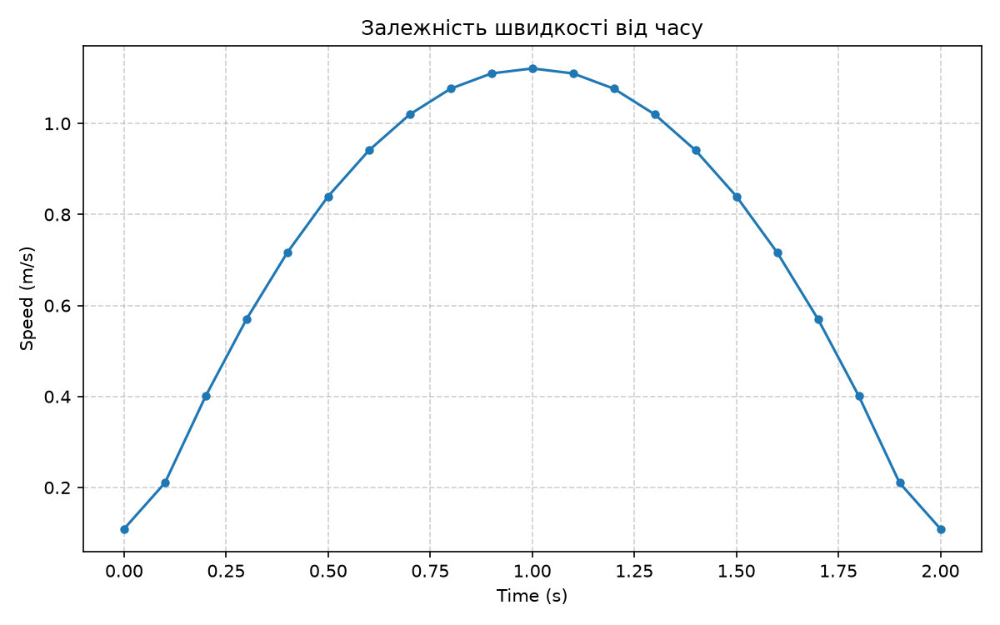
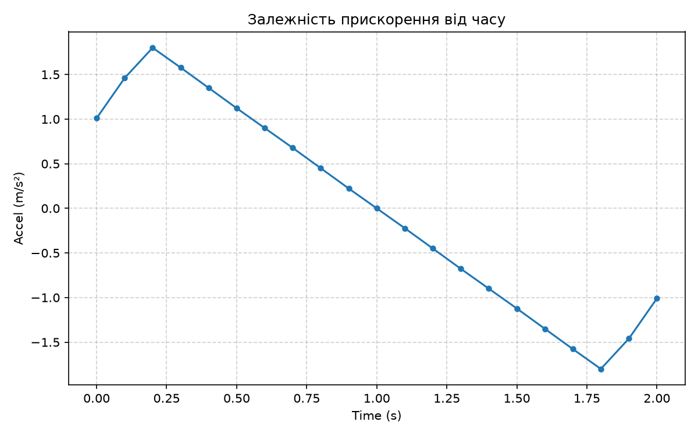
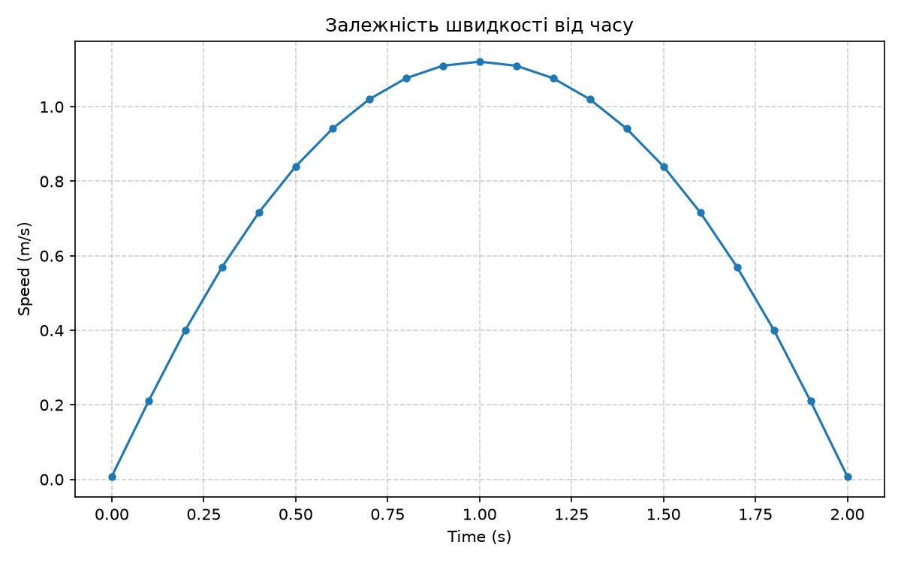
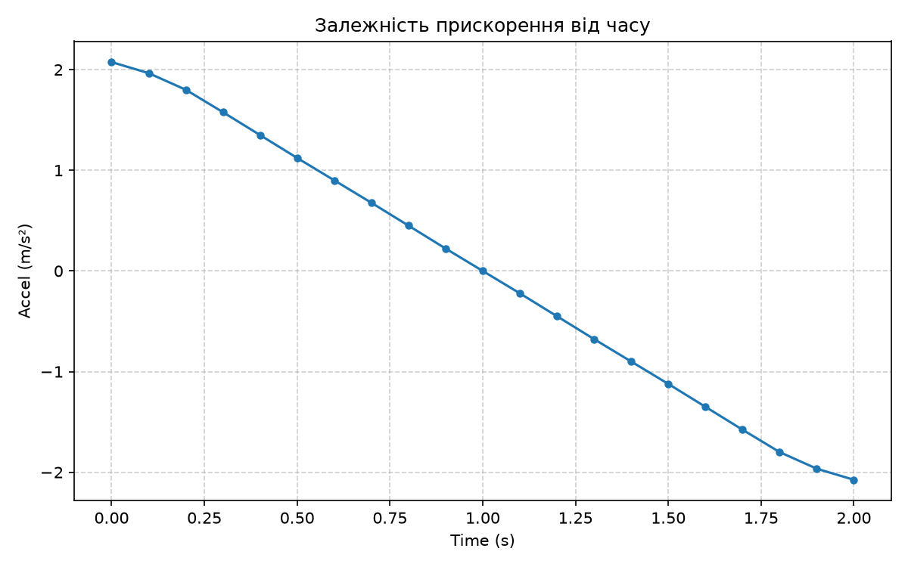

# Звіт з виконання завдання: Чисельне обчислення швидкості та прискорення

**Виконав:** Марко Пастернак  

---

## 1. Обрахунок похідних вручну

### Опис методу
Оскільки аналітична функція переміщення від часу невідома, швидкість та прискорення обчислюються чисельними методами. Швидкість є першою похідною від переміщення, що геометрично відповідає тангенсу кута нахилу січної до графіка. 

Для внутрішніх точок масиву використано **метод центральної різниці**. Він обчислює нахил між сусідніми значеннями на один крок часу вперед та на один крок часу назад. Цей метод має квадратичну точність $O(\Delta t^2)$:

$$v_i = \frac{y_{i+1} - y_{i-1}}{t_{i+1} - t_{i-1}}$$

Однак на краях масиву (перший та останній індекси) застосувати цей метод неможливо через відсутність попередньої або наступної точки. Тому для початкової точки використано **пряму (передню) різницю**, а для кінцевої — **зворотну (задню) різницю**:

$$v_0 = \frac{y_1 - y_0}{t_1 - t_0} \quad \text{та} \quad v_n = \frac{y_n - y_{n-1}}{t_n - t_{n-1}}$$

Ці однобічні методи використовують лише дві точки, тому їхня точність є лінійною $O(\Delta t)$, тобто значно нижчою за центральну різницю. Через змішування методів різного порядку точності (високої в центрі та низької на краях), під час подальшого обчислення другої похідної (прискорення) виникають математичні артефакти — різкі стрибки (злами) на краях графіка, які не відповідають реальній фізичній поведінці системи.

### Графіки результатів

**Графік залежності швидкості від часу $v(t)$:**

**Графік залежності прискорення від часу $a(t)$:**

---

## 2. Обрахунок похідних з використанням np.gradient

### Опис методу та порівняння результатів
Щоб уникнути похибок і зламів на краях, доцільно використовувати функцію `np.gradient` із бібліотеки NumPy. 

За замовчуванням ця функція використовує центральну різницю для центру та двоточкові однобічні різниці для країв, що дало б такий самий стрибкоподібний графік. Проте додавання параметра `edge_order=2` змушує алгоритм використовувати для країв складніші **трьохточкові однобічні різниці**. Вони враховують не дві, а три сусідні точки, що підвищує точність крайових обчислень до квадратичної $O(\Delta t^2)$:

$$v_0 = \frac{-3y_0 + 4y_1 - y_2}{2\Delta t} \quad \text{(для початкової точки)}$$
$$v_n = \frac{3y_n - 4y_{n-1} + y_{n-2}}{2\Delta t} \quad \text{(для кінцевої точки)}$$

Завдяки тому, що тепер і центр масиву, і його краї диференціюються з однаково високою точністю, графік прискорення позбавляється артефактів. Як бачимо на малюнках нижче, результати `np.gradient` виглядають ідеально гладкими від першої до останньої секунди.

### Графіки результатів (np.gradient)

**Графік залежності швидкості від часу $v(t)$ (np.gradient):**

**Графік залежності прискорення від часу $a(t)$ (np.gradient):**
